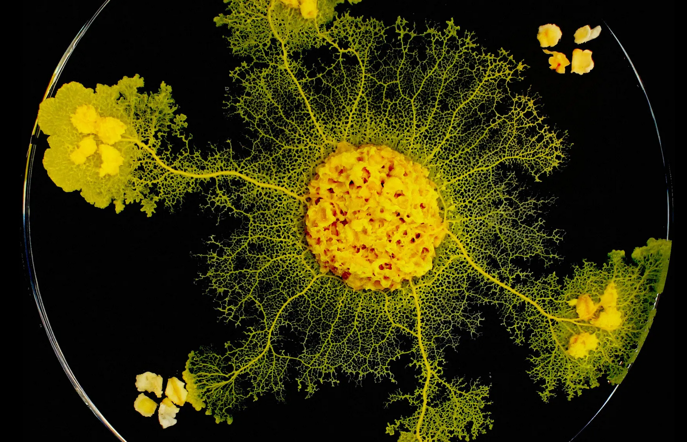
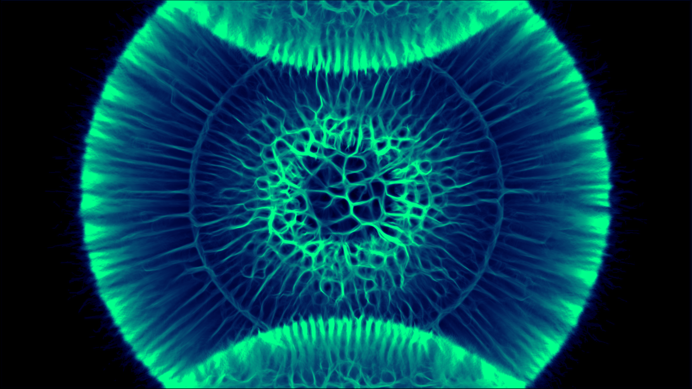
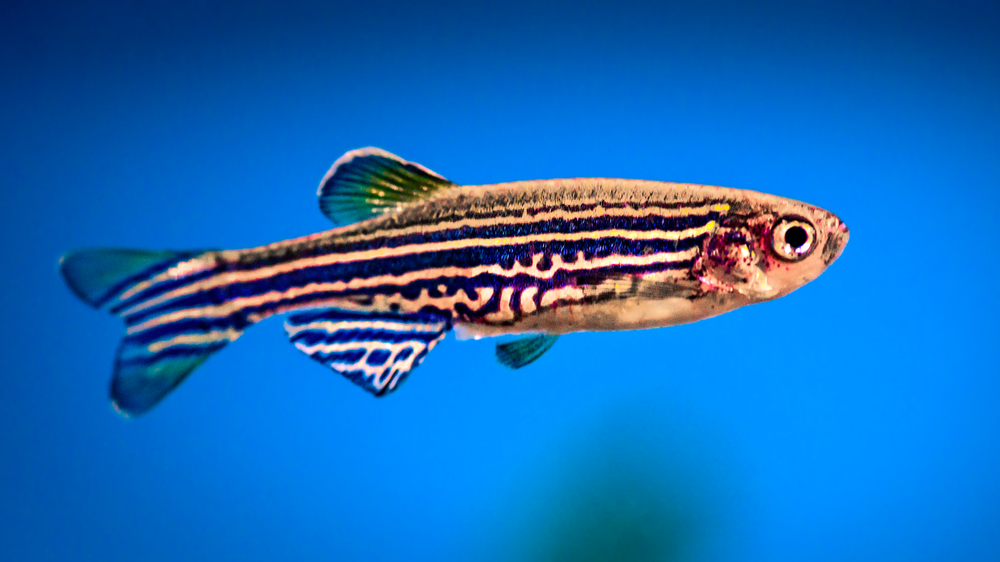
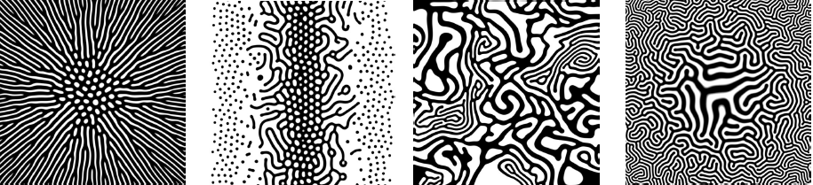
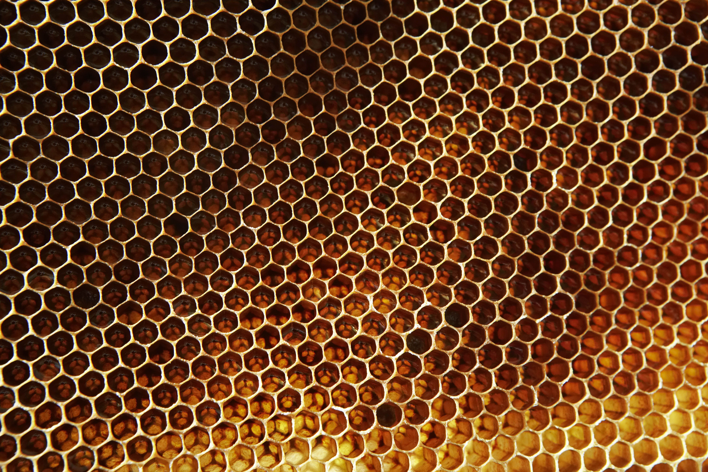
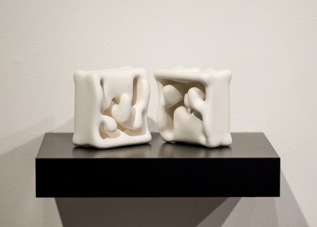
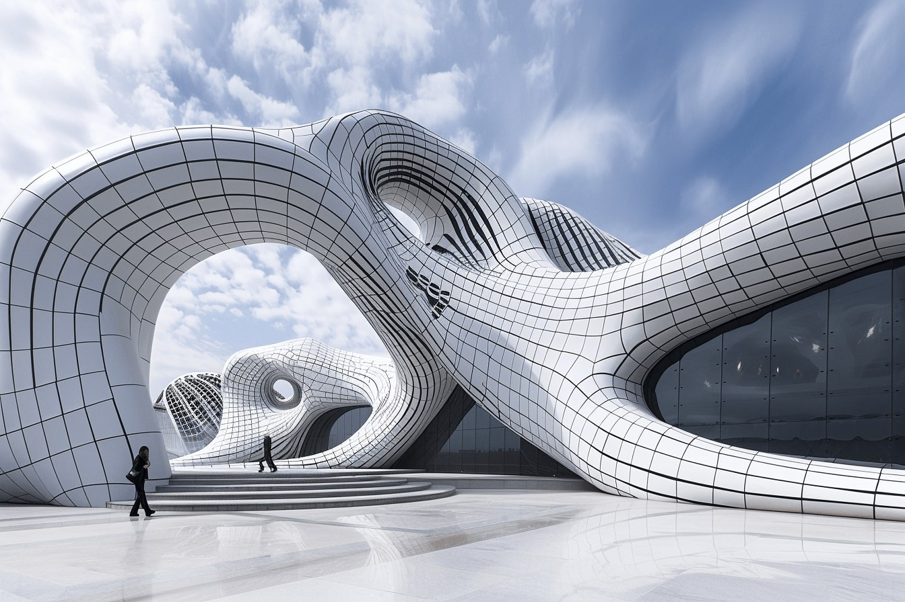
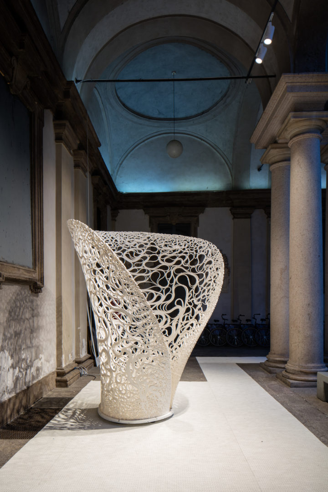

Examples of Computatonal Design

## Designed by Nature

### Flora - Slime Molds

*Audry Dussutour via Wired Magazine*

Slime mold exhibits a range of intelligent behaviors - including a fractal pathfinding behavior it uses to seek out food. The mold sends out vein-like envoys that explore an environment - when food is located, all non-pertinent paths are retracted.

The behavior was observed in a 2012 study to be robust enough to not only solve mazes, 
but also find the most efficient route through them.

The behavior can be emulated using a compute shader:

*Sebastian Lague, Slime Simulation*

*Sources:*  
<https://pubmed.ncbi.nlm.nih.gov/22328188/>  
<https://www.pbs.org/wgbh/nova/article/  slime-mold-smart-brainless-cognition/>   
<https://appvoices.org/2019/10/11/slime-mold-intelligence/>  
<https://github.com/SebLague/Slime-Simulation?tab=readme-ov-file>  

### Fauna - Animal Patterns

*Zebra Fish, via Powers Scientific*

The patterns of the Zebra fish are the result of the interaction between two different types of cells - black melanophors and yellow xanthophores. The black cells are attracted the yellow cells - but yellow cells are repelled by the black cells - forming evenly spaced patterns that are stratefied as the cells mature.

This relationship was modelled by Alan Turing as an interaction between what he called morphogens - an Activator, and an Inhibitor. Different ratios of influence lead to different patterns. This model can be used to describe a variety of natural patterns including animal spots and slime mold colonies.

Turing's model was the basis for the Gray-Scot equations for chemical interactions, also known as Reaction Diffusion equations, which are frequently used in computer graphics to simulate natural patterns.

*Reaction Diffusion examples by Karl Sims*

*Sources:*  
<https://aussieanimals.com/general/animal-pattern-formation/>  
<https://powersscientific.com/effects-of-lighting-on-zebrafish/>  
<https://groups.csail.mit.edu/mac/projects/amorphous/GrayScott/>  
<https://www.karlsims.com/rd.html>  

### Structures - Beehives

*Erik Rassmusen via Popular Mechanics*

Beehives are the most efficient structure in nature - emulating the most efficient compartmental structure in geometry according to The Honeycomb Conjecture: "regular hexagons provide the least-perimeter way to enclose infinitely many unit areas in the plane."

*Sources:*  
<https://www.popularmechanics.com/science/animals/g518/8-amazing-architects-of-the-animal-kingdom/>  
<https://pdodds.w3.uvm.edu/files/papers/others/2000/hales2000a.pdf>  

## Designed by Humans

#### Embryos - Brian Knep

Initially shown in a joint expedition with alongiside his wife's traditional hand made ceramics - Brian Knep's Emryos are "grown" in a simulation and then 3D printed.

"An exploration of fertility and lack of control, each 'embryo' is grown in a simulation of a vat of chemicals. Randomness and variability ensure that each is unique. Whatever grows is 3D-printed in stoneware and left unglazed."

*Source:* <http://www.blep.com/works/embryos/>  

#### Heydar Aliyev Center, Azerbaijan

.jpg)

The Heydar Aliyev Center is a monumenal example of using parametric modelling to design a free form building. 

*Source* <https://www.archdaily.com/448774/heydar-aliyev-center-zaha-hadid-architects>  

#### Cryptide Sneaker - 3D Printed Shoe

The Cryptide Sneaker is a fully 3D printed shoe. The shoe is printed in a single pass, and made out of a single material - Thermoplastic polyurethane - which is printed in various patterns and densities to form the different functions of the show - upper, sole, etc.

*Source:* <https://d5mag.com/behind-the-design-stephan-henrich-on-creating-the-cryptide-sneaker/>  

## Computational Design Innovators

### Antoni Gaudi

*Sagrada Familia Nave via Smithsonian Magazine*

Antoni Gaudi pioneered techniques that laid the groundwork for modern parametric design in architecture. Working entirely analogue - his techniques for form-finding and optimization are direct precursors to modern generative design methods. His structures often imitate structures in nature - including honeycomb and animal skeletons. 

Here he used a novel technique of an inverted, hanging model in order to calculate ideal parabolic arcs for Sagrada Familia in Barcelona:

*Hanging Chain Model of Sagrada Familia*

*Sources:*  
<https://journals.library.columbia.edu/index.php/TMR/article/view/8199>  
<https://www.novatr.com/blog/using-computational-design-for-sagrada-familia>  
<https://parametric-architecture.com/gaudi-architecture-science/>  

### Zaha Hadid Architects 

Thallis is an installation by the Zaha Hadid Computational Design Research Group - exploring the limits of manufacturing, 3D printing and computational design. At first glance - it appears to be a modern expansion of the visual language of Gaudi's architecture. The structures in the installation are the result of of "robotics assisted additive manufacturing"

*Source:* <https://www.zaha-hadid.com/design/thallus-installation/>  

